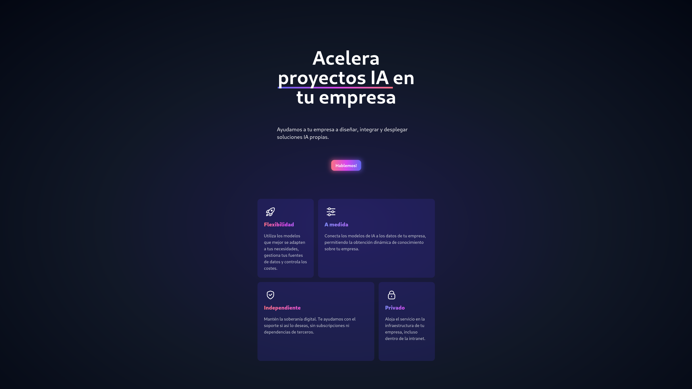

# delgate AI

A simple landing website for delgate AI.

## Development

We are using [tailwind css](v2.tailwindcss.com) with plain html.

1. `npm install -D` to install project dependencies
2. `npx postcss -w src/tailwind.css -o src/style.css` to regenerate the css file
3. `npx live-server` to serve the files
